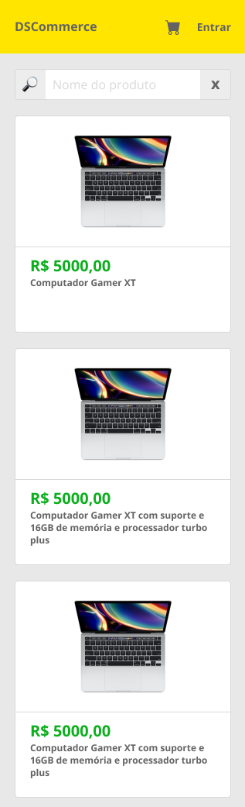
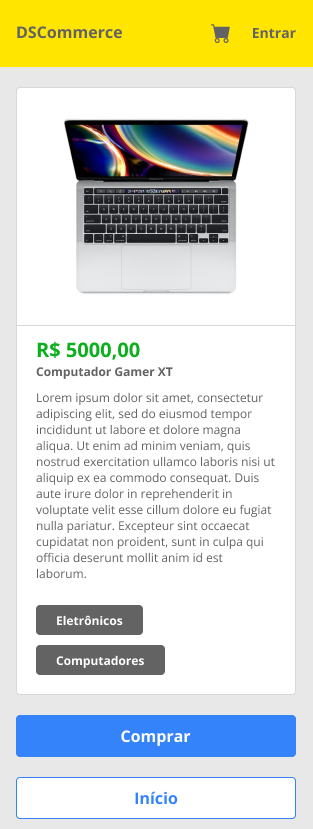
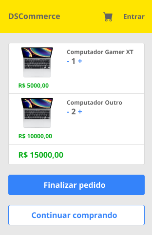
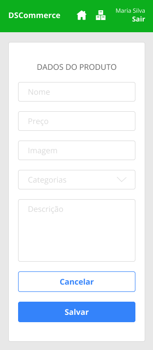
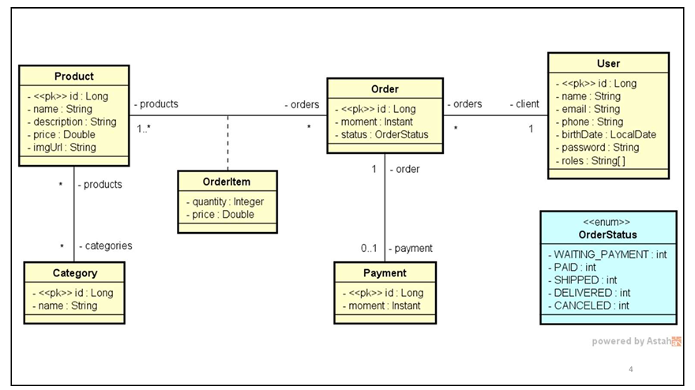

## Premissas

Deseja-se fazer um sistema para ser utilizado em cursos da 
DevSuperior no processo de aprendizado dos alunos. Para isso, 
a concepção do sistema partiu das seguintes premissas

    * Deve ser um sistema que possua um modelo de domínio relativamente
    simples, porém abrangente, ou seja, que explore vários tipos de
    relacionamento entre as entidades de negócio.

    * O sistema deve possibilitar a aplicação de vários conhecimentos
    importantes das disciplinas de fundamentos.

    * O sistema deve conter as principais funcionalidade que se espera
    de um profissional júnior deve saber construir, tais como telas
    de cadastro e fluxos de caso de uso.

## Visão Geral

O sistema deve manter um cadastro de usuário, produtos e suas categorias. Cada
usuário possui nome, e-mail, telefone, data de nascimento e uma senha de acesso. Os
dados dos produtos são: nome, descrição, preço e imagem. O sistema deve apresentar
um catálogo de produtos, os quais podem ser filtrados pelo nome do produto. A partir
desse catálogo, o usuário pode selecionar um produto para ver seus detalhes e para
decidir se o adiciona a um carrinho de compras. O usuário pode incluir e remover itens
do carrinho de compra, bem como alterar as quantidades de cada item. Uma vez que o
usuário decida encerrar o pedido, o pedido deve então ser salvo no sistema com o status
de "aguardando pagamento". Os dados de um pedido são: instante em que ele foi salvo,
status, e uma lista de itens, onde cada item se refere a um produto e sua quantidade no
pedido. O status de um pedido pode ser: aguardando pagamento, pago, enviado,
entregue e cancelado. Quando o usuário paga por um pedido, o instante do pagamento
deve ser registrado. Os usuários do sistema podem ser clientes ou administradores,
sendo que todo usuário cadastrado por padrão é cliente. Usuários não identificados
podem se cadastrar no sistema, navegar no catálogo de produtos e no carrinho de
compras. Clientes podem atualizar seu cadastro no sistema, registrar pedidos e visualizar
seus próprios pedidos. Usuários administradores tem acesso à área administrativa onde
pode acessar os cadastros de usuários, produtos e categorias.

## Protótipo de telas

Catalogo dos produtos

Descrição dos produtos

Carrinho de compras

Cadastro dos produtos

## Modelo conceitual

Este é o modelo conceitual do sistema DSCommerce:

    * Cada item de pedido (OrderItem) corresponde a um produto
    no pedido, com uma quantidade. Sendo que o preço também é 
    armazenado no item de pedido por questões de histório, ( se o
    preço mudar no futuro, o preço do item de pedido continua 
    registrado com o preço pago no ato da venda).

    * Um usuário pode ter um ou mais "roles", que são os perfis de
    acesso ao sistema sendo esses de cliente ou adiministrador.

UML: 

## Desenvolvido por Juliano Martins 

## Contato:

  

  
  
  
  

